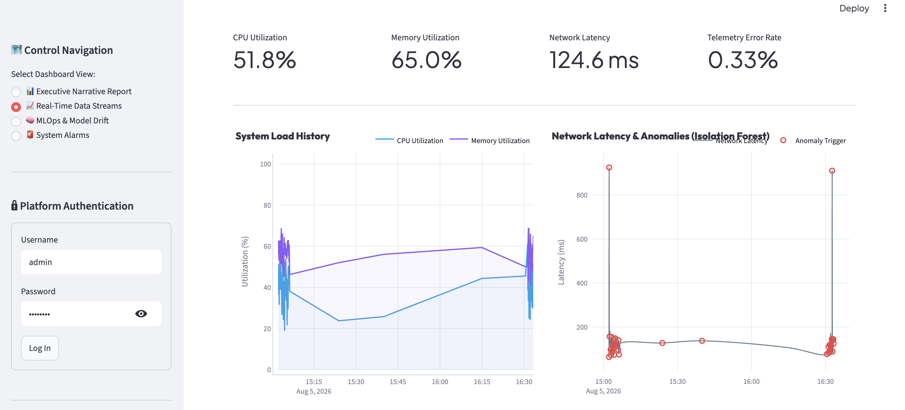
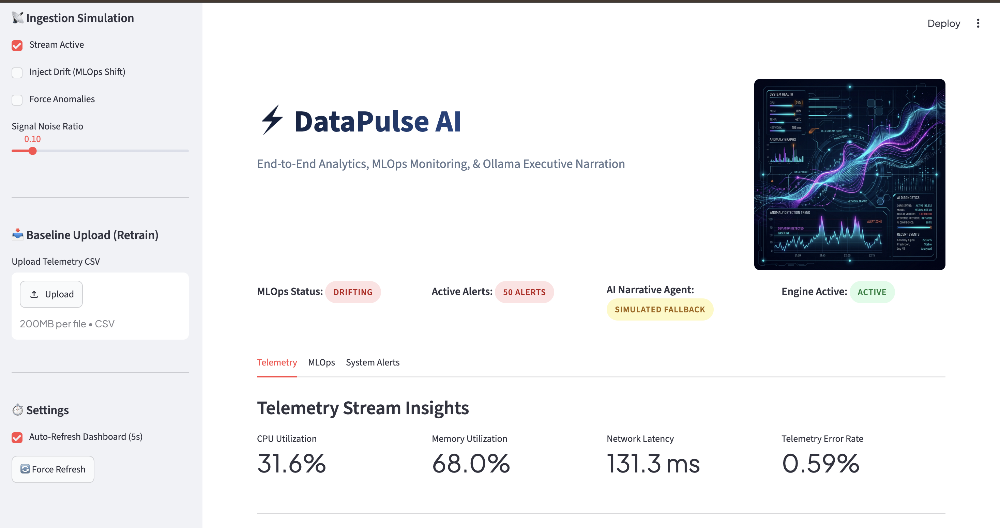
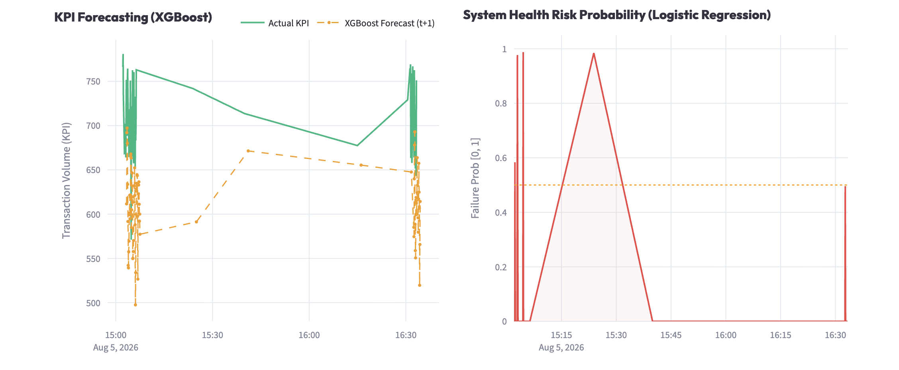

# ⚡ DataPulse AI

> End-to-End MLOps Monitoring Dashboard with Real-Time Analytics & AI Executive Narration

A full-stack platform that simulates live infrastructure telemetry, runs it through a 3-model ML pipeline, detects anomalies and model drift, and generates executive-level insights via Ollama (Mistral) — all visualized in a real-time Streamlit dashboard.

## Screenshots

### Real-Time Data Streams


### MLOps Status — DRIFTING State


### KPI Forecasting & Health Risk


## Tech Stack

| Layer | Technology |
|-------|-----------|
| Backend API | FastAPI + SQLAlchemy + SQLite |
| Frontend | Streamlit + Plotly |
| Anomaly Detection | Isolation Forest |
| KPI Forecasting | XGBoost |
| Health Classification | Logistic Regression |
| Background Engine | APScheduler |
| AI Narration | Ollama (Mistral) + rule-based fallback |
| Auth | JWT Bearer Tokens |


## Quick Start
```bash
pip install -r requirements.txt
python -m backend.app.main        # Terminal 1
streamlit run frontend/app.py     # Terminal 2
```
Login: `admin` / `admin123`
